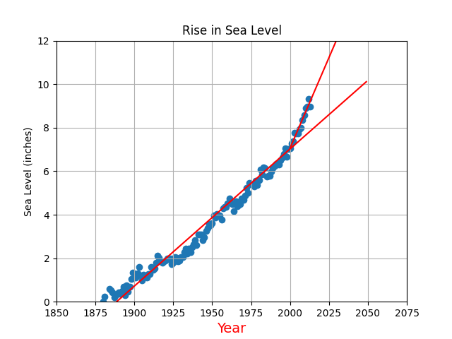
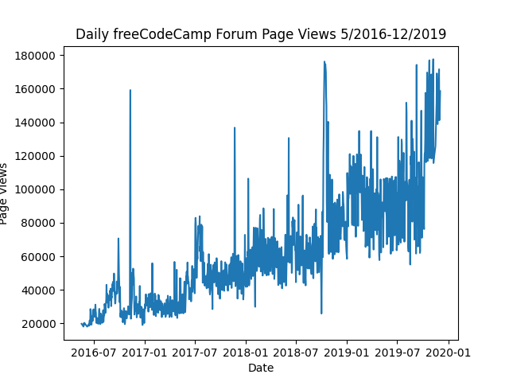
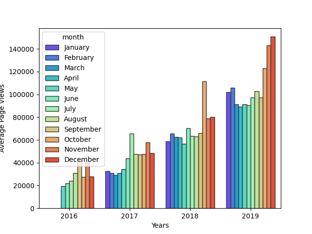
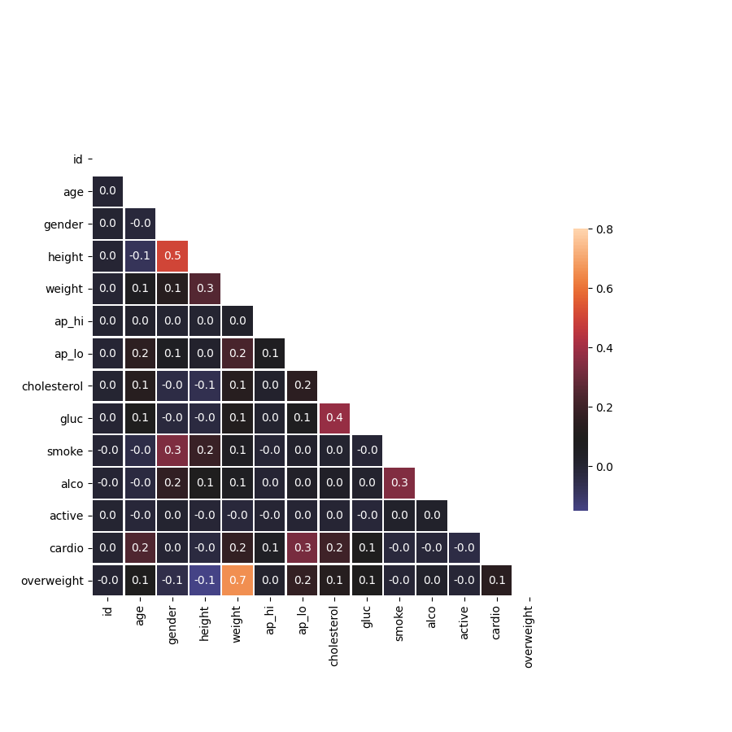

# Project Setup

The project environment is setup using pipenv. [How to set up your environment.](PIPENV.md)

# Project Description

Example of Several projects and their testcases.

1. [Password Cracker (using hashlib)](./networking/password_cracker/README.md)

1. [Port Scanner (using socket)](./networking/port_scanner/README.md)

1. [Sea Level Predictor (using Pandas, Matplotlib, and Scipi)](./data_analysis/ch05-sea-level-predictor/README.md)

1. [Time Series Visualizer (using Pandas, Matplotlib, and Seaborn)](./data_analysis/ch04-time-series-visualizer/README.md)

1. [Medical Data Analyzer (using Pandas)](./data_analysis/ch03-medical-data-visualizer/README.md)

1. [Rock Paper Scissor (using tensorflow)](./tensorflow/rock-paper-scissor/README.md)